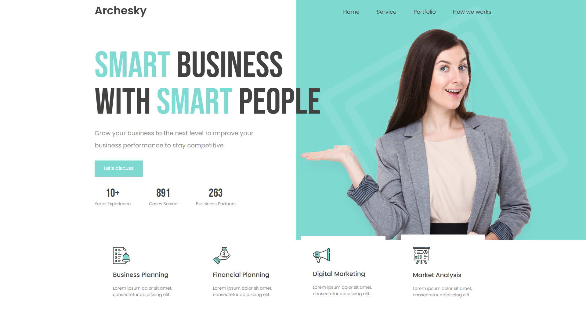

# Header Business Agency

Una plantilla moderna para el encabezado de una agencia de negocios, diseñada como ejemplo de proyecto utilizando únicamente HTML y CSS. Esta sección de cabecera es ideal para mostrar los servicios principales de una empresa con un diseño profesional y atractivo.

## 📑 Tabla de Contenidos

- [Introducción](#introducción)
- [Características](#características)
- [Captura de Pantalla](#captura-de-pantalla)
- [Instalación](#instalación)
- [Uso](#uso)
- [Dependencias](#dependencias)
- [Personalización](#personalización)
- [Ejemplos](#ejemplos)
- [Contribuciones](#contribuciones)
- [Autor](#autor)
- [Licencia](#licencia)

## 🧩 Introducción

Este proyecto proporciona un encabezado web adaptable para sitios de agencias de negocios. Incluye una presentación clara de servicios clave y un diseño profesional optimizado para usabilidad y estética. Este proyecto es solo un ejemplo y no está destinado a producción.

## ✨ Características

- Diseño responsivo y moderno
- Navegación superior: Inicio, Servicios, Portafolio, ¿Cómo trabajamos?
- Llamado a la acción con botón "Let's discuss"
- Estadísticas destacadas de experiencia, casos resueltos y socios comerciales
- Sección de servicios con íconos: Planificación Empresarial, Finanzas, Marketing y Análisis

## 🖼️ Captura de Pantalla



## 🚀 Instalación

1. Clona este repositorio:
```
git clone https://github.com/FrankJimenez79/header_business_agency.git
```

2. Navega al directorio del proyecto:
```
cd header_business_agency
```

3. Abre el archivo `index.html` en tu navegador.

## 🧪 Uso

Este encabezado puede utilizarse como base para sitios web empresariales, landing pages o proyectos de práctica.

## 📦 Dependencias

- HTML5
- CSS3
- No requiere frameworks ni bibliotecas externas

## ⚙️ Personalización

Puedes modificar:

- Los textos directamente desde el archivo `index.html`
- Colores, fuentes y estilos desde `style.css`
- Imágenes e íconos según tus necesidades

## 📚 Ejemplos

Puedes integrarlo como parte inicial de un sitio completo para una consultora o agencia de servicios digitales.

## 🙌 Contribuciones

Las contribuciones son bienvenidas. Puedes abrir un issue para sugerencias o enviar un pull request con mejoras.

## 👨‍💻 Autor

Proyecto desarrollado por **Frank Jiménez** como ejemplo de encabezado para sitio web empresarial.
